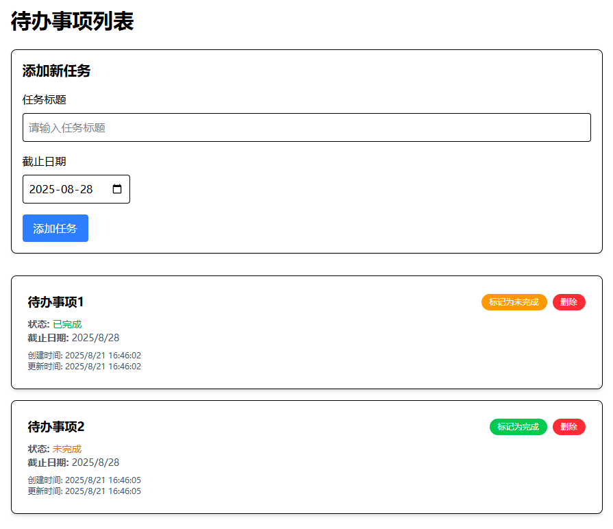

# 应用简介
本应用是一个前后端分离的项目，实现了一个简单的待办事项列表 to do list

## 项目效果预览图


## 技术栈
后端使用gin, gorm, sqlite3
### 后端
- 框架: Gin
- ORM: GORM
- 数据库: SQLite3 (轻量级，方便本地开发)
- API 文档: Swaggo (自动生成 Swagger 文档)

### 前端
- 框架: React
- UI 库: Tailwind CSS
- HTTP 客户端: Axios
- 构建工具: Vite

## 后端依赖
- `github.com/gin-contrib/cors v1.7.6`
- `github.com/gin-gonic/gin v1.10.1`
- `github.com/swaggo/files v1.0.1`
- `github.com/swaggo/gin-swagger v1.6.0`
- `github.com/swaggo/swag v1.16.6`
- `gorm.io/driver/sqlite v1.6.0`
- `gorm.io/gorm v1.30.1`

## 前端依赖
- axios
- tailwindcss
- @tailwindcss/vite
- react-dom

# 使用方法
1. 运行后端
cd 进入目录
依次运行以下命令
```sh
# 初始化 Go 模块 (如果还未初始化)
go mod init todo_back

# 同步并下载所有依赖
go mod tidy

# 启动后端服务
go run .
```
如果是windows系统，使用`go build`，会生成`todo_back.exe`文件，直接双击即可运行
后端网址：`http://localhost:1111`
后端接口文档：`http://localhost:1111/swagger/index.html`

2. 运行前端
cd 进入目录
依次运行以下命令
```sh
# 使用 pnpm 安装依赖
pnpm i
pnpm i axios
pnpm i tailwindcss @tailwindcss/vite

# 启动前端应用
pnpm run dev
```

3. 打开前端网址`http://localhost:5173/`

